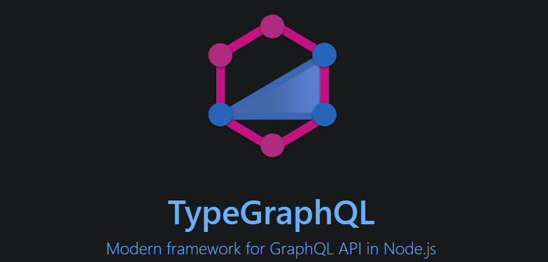

# API GRAPHQL

* Under fetching
  * Rota HTTP que retorna dados de menos

* Over fetching 
  * Rota HTTP que retorna menos dados do que precisamos

### simple-server
* Schema first approach

### server
* Code first 